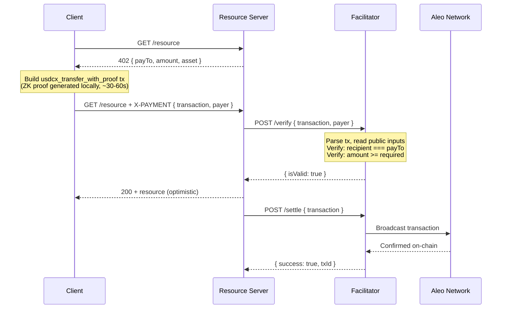

# Architecture

## x402: Internet-Native Payments

[x402](https://github.com/coinbase/x402) is an open protocol for internet-native payments built on HTTP's `402 Payment Required` status code. It enables servers to require payment for resources and clients to pay inline with standard HTTP requests — no redirect flows, no payment pages, no session state.

The protocol defines three roles:

- **Client** — requests a resource, receives a 402 response with payment requirements, builds a payment, and retries with a `X-PAYMENT` header
- **Resource Server** — hosts the resource, returns 402 with pricing, and delegates payment verification/settlement to a facilitator
- **Facilitator** — verifies that a payment is valid (`/verify`) and settles it on-chain (`/settle`), abstracting blockchain complexity from the server

The flow is designed for machine-to-machine commerce: an AI agent can discover a price, pay, and receive data in a single request cycle.

## Aleo: Private Execution

[Aleo](https://aleo.org) is a blockchain where program execution happens off-chain via zero-knowledge proofs. Programs are written in [Leo](https://docs.leo-lang.org/) and compiled to circuits. When a user executes a program function, the proof is generated locally and only the proof (plus any explicitly public outputs) is submitted to the network. This means:

- **Private records** — token balances, credentials, and other state are encrypted on-chain, visible only to the owner
- **Private inputs** — function arguments marked `private` in Leo are never revealed
- **Public inputs** — function arguments marked `public` are visible on-chain and in the transaction
- **Zero-knowledge proofs** — the network verifies that execution was correct without seeing private data

Aleo's compliant stablecoin programs ([USDCx](https://usdcx.aleo.org/), [USAD](https://usad.aleo.org/)) use this model. A `transfer_private_with_creds` call takes the recipient, amount, a Token record, and a Credentials record — all as private inputs. The resulting transaction reveals nothing about who paid whom or how much.

## Bringing Them Together

The challenge: x402 requires the facilitator to verify that a payment is going to the right recipient for the right amount. But on Aleo, those values are private by default.

### The Wrapper Program

Our solution is `x402.aleo`, a thin wrapper program deployed on-chain:

```leo
program x402.aleo {
    async transition usdcx_transfer_with_proof(
        public recipient: address,
        public amount: u128,
        token_record: usdcx_stablecoin.aleo/Token,
        credentials_record: usdcx_stablecoin.aleo/Credentials
    ) -> (...) {
        let (...) = usdcx_stablecoin.aleo/transfer_private_with_creds(
            recipient, amount, token_record, credentials_record
        );
        return (...);
    }
}
```

The wrapper does one thing: it re-declares `recipient` and `amount` as **public** inputs, then passes them through to the underlying stablecoin's private transfer. The ZK proof guarantees that the public values match what was actually used in the transfer. Everything else (sender identity, token balances, credentials) remains private.

This is a safe trade-off because recipient and amount are already disclosed in the x402 protocol's 402 response — the server publicly advertises its address and price. Making them public on-chain doesn't leak information that isn't already available from the HTTP exchange.

### Payment Flow



The resource is served **optimistically** after verification — settlement happens asynchronously. The facilitator never receives the funds; `payTo` is the resource server's address.

### What the Client Builds

The client signer (`toClientAleoSigner`) takes a private key, a Token record, and a Credentials record. It uses the `@provablehq/sdk` to:

1. Construct inputs: `[recipient, amount_u128, tokenRecord, credentialsRecord]`
2. Call `programManager.buildExecutionTransaction()` targeting `x402.aleo/usdcx_transfer_with_proof`
3. Generate the full ZK proof locally (30-60 seconds)
4. Return the serialized transaction

The transaction is fully proved but not broadcast. The client sends it to the server, which forwards it to the facilitator.

### What the Facilitator Verifies

The facilitator scheme (`ExactAleoScheme`) receives the serialized transaction and:

1. Parses it into a WASM `Transaction` object
2. Checks the replay cache and the network for duplicates
3. Extracts the first transition and verifies it targets `x402.aleo/usdcx_transfer_with_proof`
4. Reads the public inputs directly — `inputs[0]` is the recipient address, `inputs[1]` is the amount
5. Asserts `recipient === payTo` and `amount >= required`

No decryption, no keys, no view access. The public inputs are plaintext in the transaction because the Leo program declared them as `public`.

### Compliance

The USDCx stablecoin enforces a freeze list. Every transfer requires a Credentials record that proves the sender is not on the freeze list (via a Merkle non-inclusion proof). The wrapper program passes this record through to the underlying `transfer_private_with_creds` call, so compliance is enforced at the protocol level. The Credentials record itself remains private — only the freeze-list check result is proven.

## Alternative : TVK-Based Selective Disclosure

An alternative approach uses **Transition View Keys (TVKs)** to selectively disclosure the recipient and amount of the transaction.

### How It Worked

In Aleo, every transition has a Transition Public Key (TPK). The account holder can derive a Transition View Key (TVK) from the TPK using their private key. The TVK can decrypt that specific transition's private inputs — and nothing else. It's a form of selective disclosure: reveal one transition's data without exposing the full view key.

The flow was:

1. Client builds a `transfer_private_with_creds` transaction (all inputs private)
2. Client derives the TVK from the transfer transition's TPK
3. Client sends `{ transaction, transitionViewKey, payer }` to the facilitator
4. Facilitator uses the TVK to decrypt the transition's private inputs
5. Facilitator reads the decrypted recipient and amount

<!-- ### Why We Moved Away

The TVK approach was more complex for no additional security benefit in this context:

- **The information isn't secret.** The 402 response already contains `payTo` and `amount` in the clear. Anyone observing the HTTP exchange knows these values. Making them public on-chain doesn't leak anything new.
- **More code.** TVK derivation required `account.generateTransitionViewKey()`, `Field.fromString()`, and `transition.decryptTransition()` — all WASM calls that added complexity to both the client signer and the facilitator.
- **More payload.** The payment payload needed a `transitionViewKey` field, adding a third piece of data to transmit and validate.
- **Fragile.** TVK decryption could fail for various reasons (malformed key, wrong transition, SDK version mismatches), requiring an additional error path (`INVALID_TVK`).

The wrapper program approach achieves the same verification with less code, fewer failure modes, and a simpler payload (`{ transaction, payer }`). The ZK proof guarantees that the public inputs match what was used in the actual transfer, so the facilitator gets the same assurance without needing any decryption capability. -->
