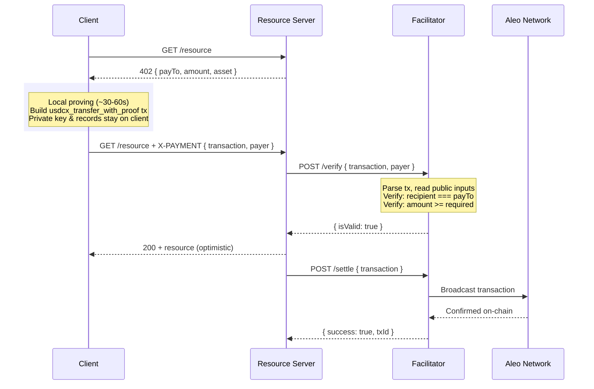
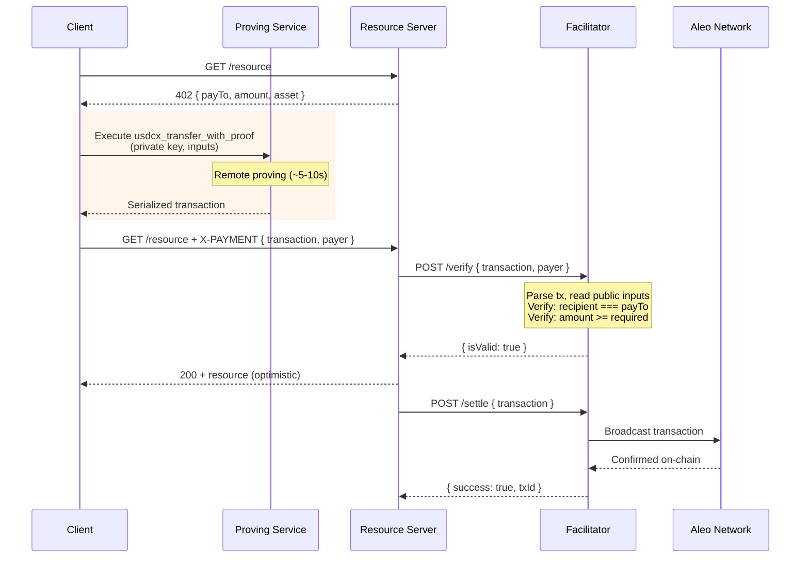

# Aleo x402


Private micropayments over HTTP using Aleo zero-knowledge proofs and the [x402 protocol](https://github.com/coinbase/x402).

Clients build fully-proved USDCx stablecoin transfers via a wrapper program (`x402.aleo`) that exposes recipient and amount as **public inputs** — the facilitator can verify these directly from the transaction without any decryption.

## WARNING: This has not been tested or audited and is not yet ready for production!  Use at your own risk.

## Packages

| Package | Path | Description |
|---------|------|-------------|
| [`@x402/aleo`](packages/aleo/) | `packages/aleo` | Core mechanism — client, facilitator, and server schemes |
| `@x402/aleo-facilitator` | `packages/facilitator` | Deployable Hono server (`/verify`, `/settle`, `/supported`) |

## Quick Start

```bash
pnpm install
pnpm build
pnpm test
```

### Facilitator

```bash
cd packages/facilitator
ALEO_PRIVATE_KEY=APrivateKey1... pnpm dev
```

### Example Server

```bash
cd examples/server
PAY_TO=aleo1... FACILITATOR_URL=http://localhost:8080 pnpm start
```

### Example Client

```bash
cd examples/client
ALEO_PRIVATE_KEY=APrivateKey1... API_URL=http://localhost:3000 pnpm start
```

## Payment Flow

### Local Proving

The client generates the ZK proof on its own hardware. Slower (~30-60s) but fully private — the private key and records never leave the client.



### Delegated Proving

The client delegates proof generation to a remote prover (e.g. [Provable's proving service](https://developer.aleo.org/)). Faster (~5-10s) but requires sending the private inputs to the prover — the client must trust the proving service.



## How It Differs from EVM/Solana x402

- Client builds the **entire transaction** (with ZK proofs) before sending — the facilitator only broadcasts it
- Verification reads **public inputs** from the transaction — no decryption needed
- Resource is served **optimistically** after `/verify` — settlement is async
- The facilitator never receives funds; `payTo` is the resource server's address
- Client pays all network fees (embedded in the transaction)

## Requirements

- Node.js >= 20
- pnpm 9+
